# `Домашнее задание к занятию "Что такое DevOps. СI/СD"` - `Мешочков Александр SYS-28`

 [Описание домашнего задания к занятию «Что такое DevOps. СI/СD»](https://github.com/netology-code/sdvps-homeworks/blob/main/8-02.md)

---

### Задание 1

`Выполнение заданий показывать скриншотами скриншотами : `

1. 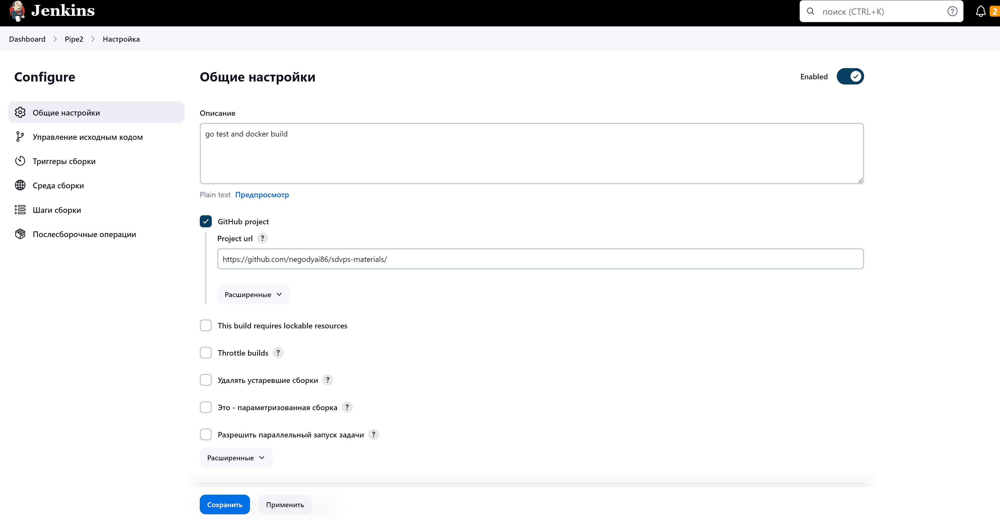

2. 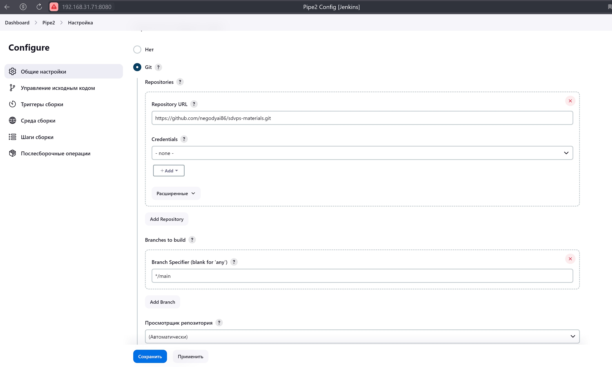

3. 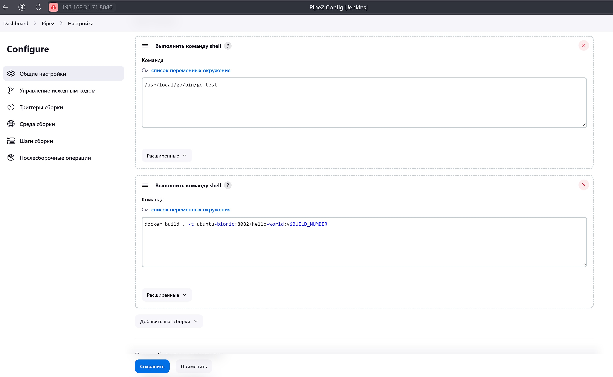

4. 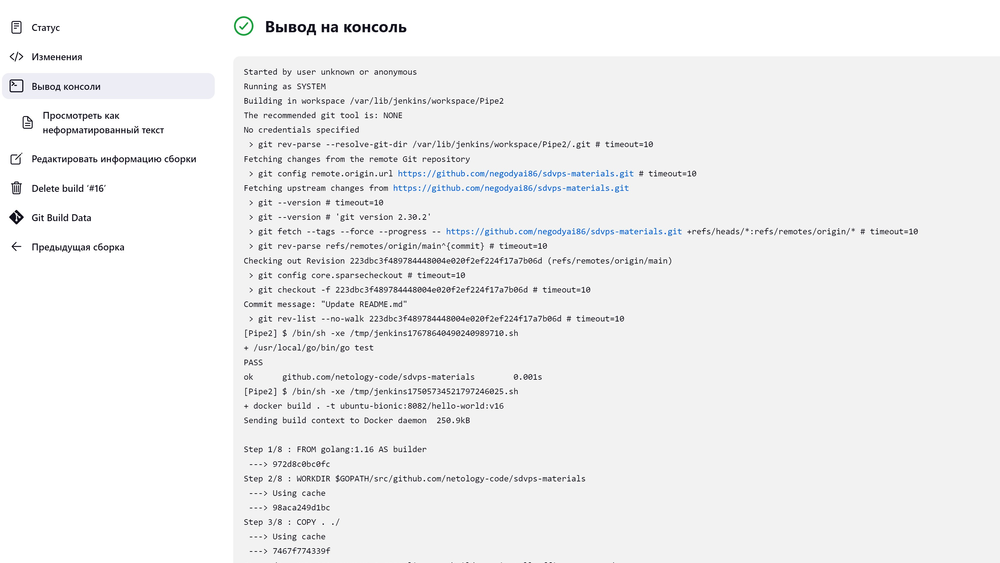

5. 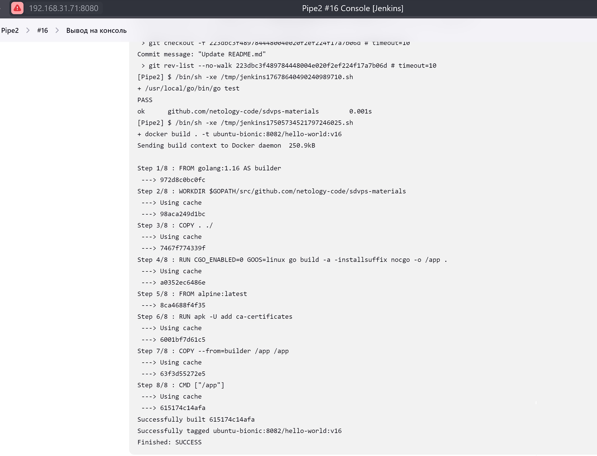

 ### Задание 2

   `Выполнение заданий показывать скриншотами скриншотами : `

   1. 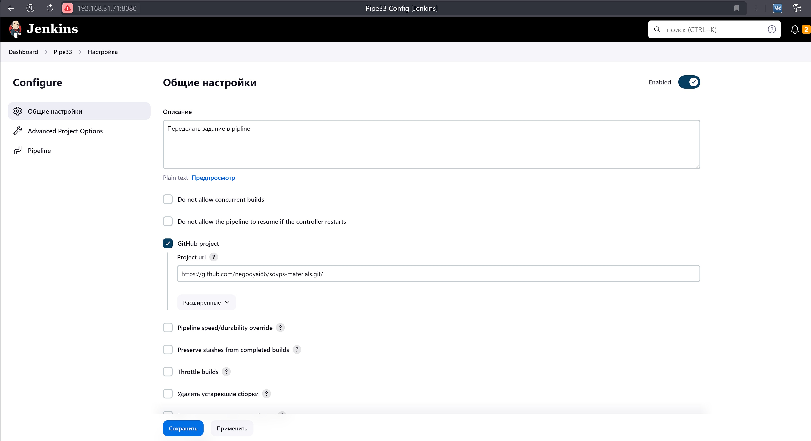

   2. 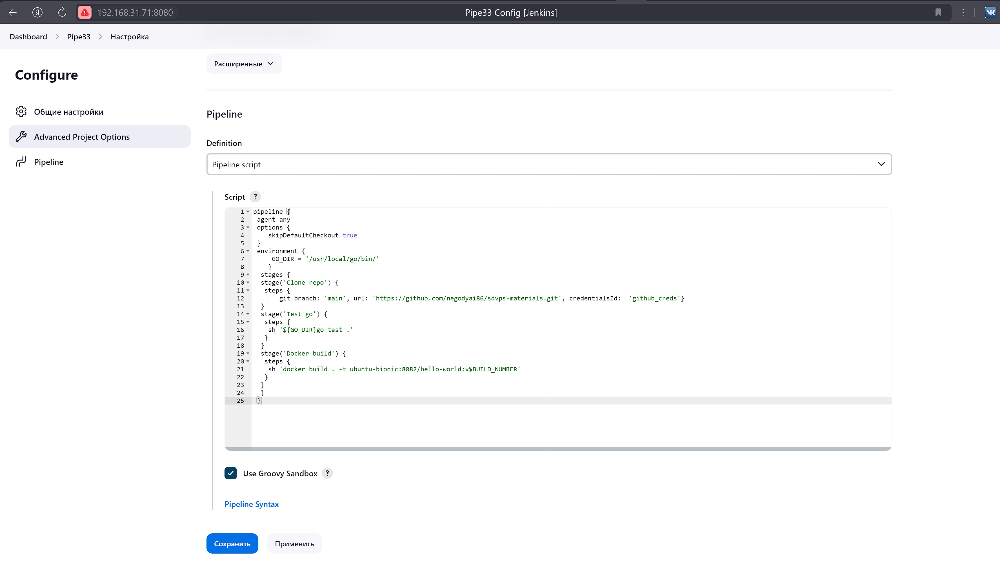
   
   3. 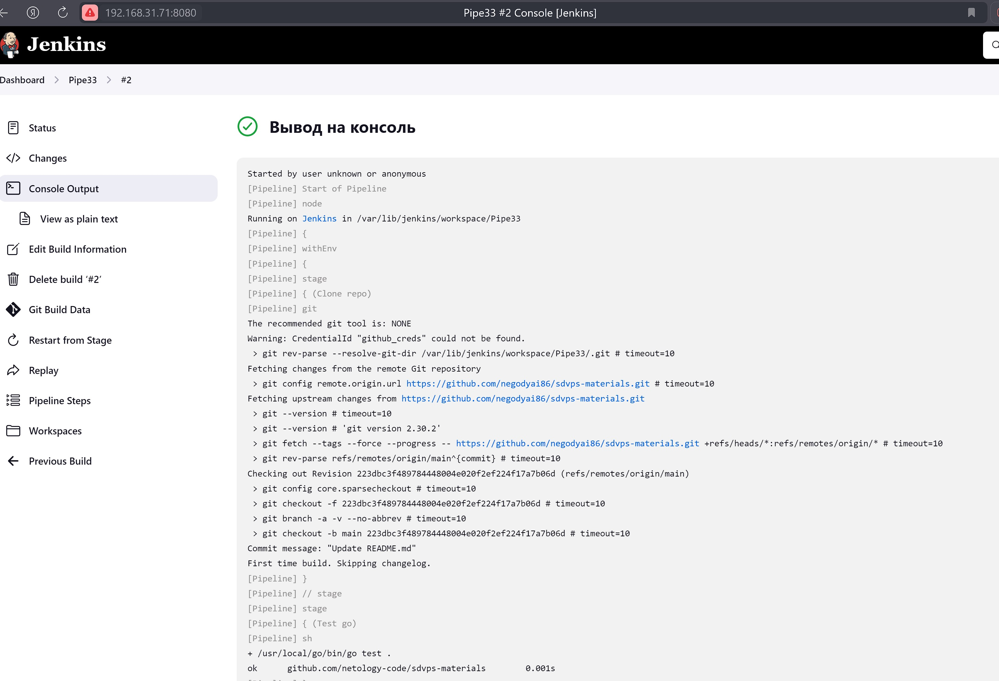
   
   4. 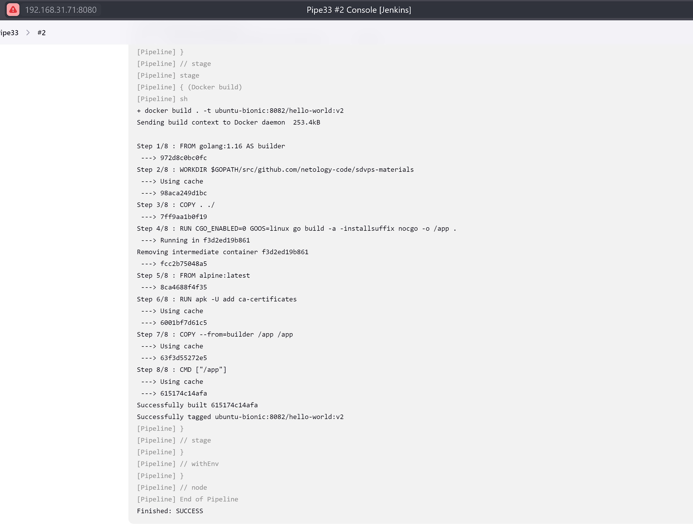
   
      

### Задание 3

`Выполнение заданий показывать скриншотами скриншотами : `

1. 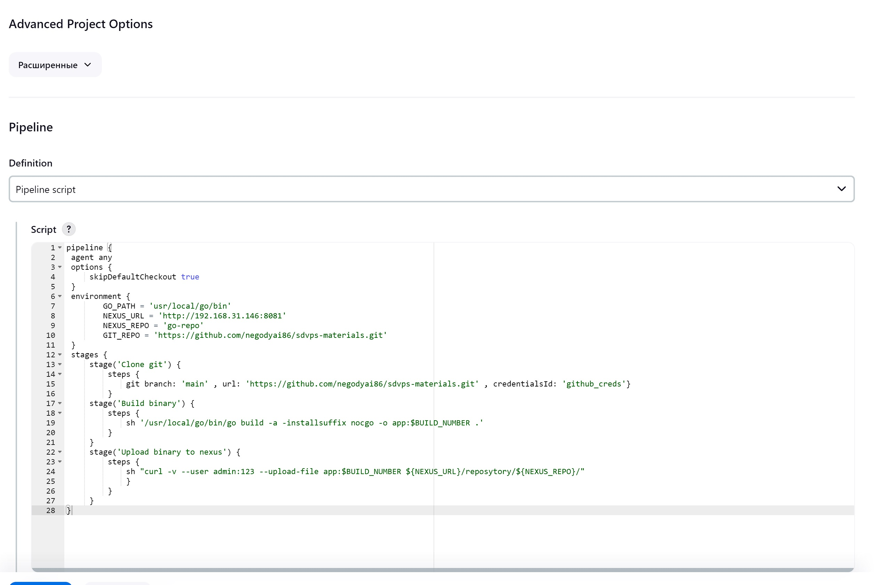

2. <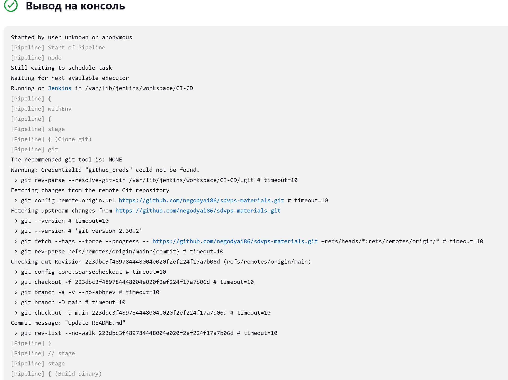

3. 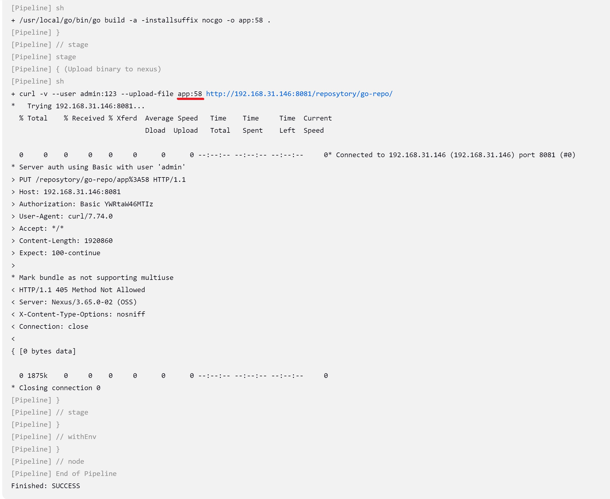

4. 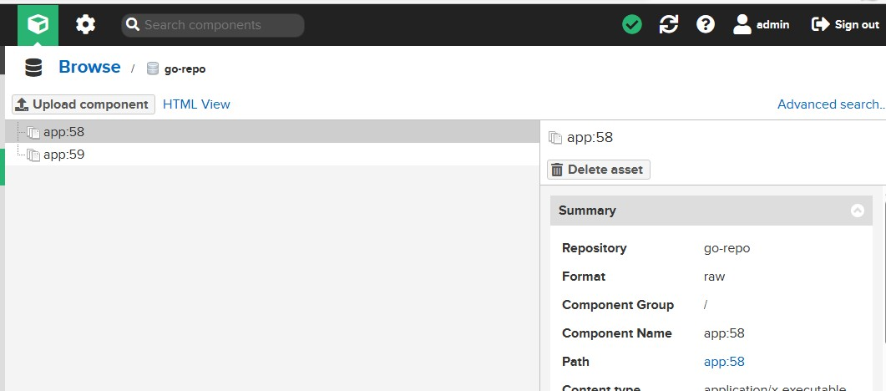

## P.s. виртуальная машина с дженкинсом была подготовлена давно, пароль был успешно забыт, поэтому пароль убрал вообще. Теперь в консоли отображается "user unknown or anonymous".

   