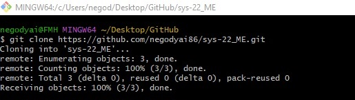
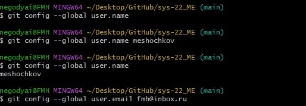
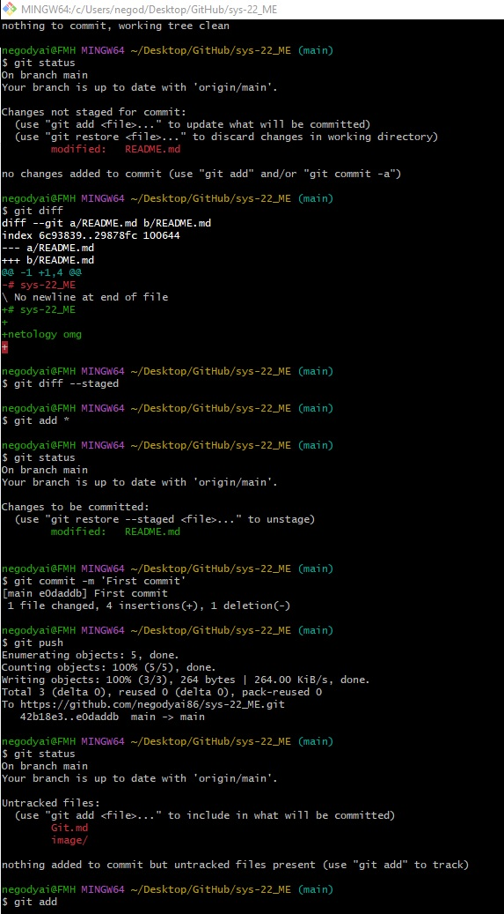
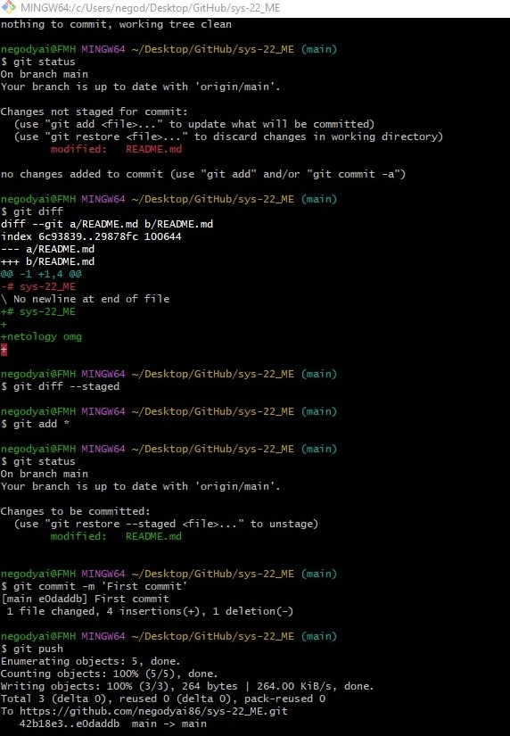

# `Домашнее задание к занятию "Git"` - `Мешочков Александр SYS-22`

1. [Описание домашнего задания к занятию «Git»](https://github.com/netology-code/sdvps-homeworks/blob/main/8-01.md)

---

### Задание 1

`Выполнение заданий показывать скриншотами скриншотами : `

Аккаунт создан

Галочка проставлена, для создания README

Склонировал репозиторий

Произвёл первоначальную настройку Git, указав своё настоящее имя и email

с 6 по 13 пункты :

[Ссылка на commit](https://github.com/negodyai86/sys-22_ME/commit/0fd498cd3ea05d5532fc91385fc35dd4df215b50)

=======