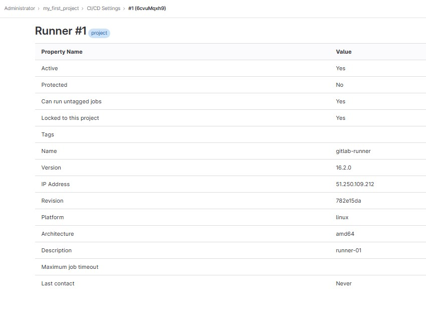

# `Домашнее задание к занятию "GitLab"` - `Мешочков Александр SYS-28`


1. [Описание домашнего задания к занятию «GitLab»](https://github.com/netology-code/sdvps-homeworks/blob/main/8-03.md)

---

### Задание 1

1. Разверните GitLab локально, используя Vagrantfile и инструкцию, описанные в этом репозитории.
2. Создайте новый проект и пустой репозиторий в нём.
3. Зарегистрируйте gitlab-runner для этого проекта и запустите его в режиме Docker. Раннер можно регистрировать и запускать на той же виртуальной машине, на которой запущен GitLab.


### Ответ 1



--------

### Задание 2

1. Запушьте репозиторий на GitLab, изменив origin. Это изучалось на занятии по Git.
2. Создайте .gitlab-ci.yml, описав в нём все необходимые, на ваш взгляд, этапы.

### Ответ 2


```yml
stages:
  - test
  - build

test:
  stage: test
  image: golang:1.17
  script: 
   - go test .

build:
  stage: build
  image: docker:latest
  script:
   - docker build .
```

##### Pipeline с sonarqube проверкой


```yml

stages:
  - test
  - static-analysis
  - build

test:
  stage: test
  image: golang:1.17
  script: 
   - go test .

static-analysis:
 stage: test
 image:
  name: sonarsource/sonar-scanner-cli
  entrypoint: [""]
 variables:
 script:
  - sonar-scanner -Dsonar.projectKey=my_first_project -Dsonar.sources=. -Dsonar.host.url=http://51.250.109.212:9000 -Dsonar.login=sqp_c3182996279b0a3f87f9e73e27dfae410aa92db6

build:
  stage: build
  image: docker:latest
  script:
   - docker build .
```

----------

### Задание 3

1. Измените CI так, чтобы:
   1. этап сборки запускался сразу, не дожидаясь результатов тестов;
   2. тесты запускались только при изменении файлов с расширением *.go.

### Ответ 3

```yml
stages:
  - test
  - build

test:
  only:
    changes:
      - "*.go"
  stage: test
  image: golang:1.17
  script: 
   - go test .

build:
  stage: build
  needs: [test]
  image: docker:latest
  script:
   - docker build .
```

--------