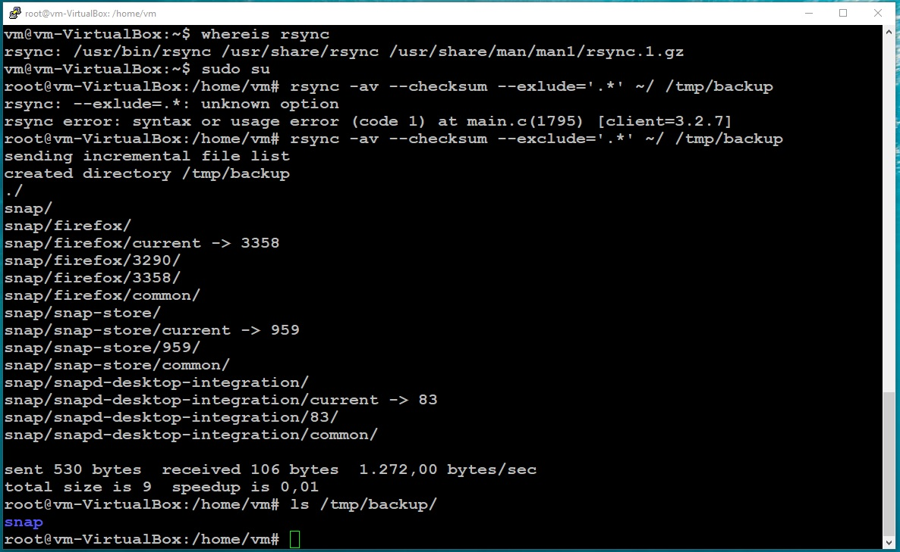
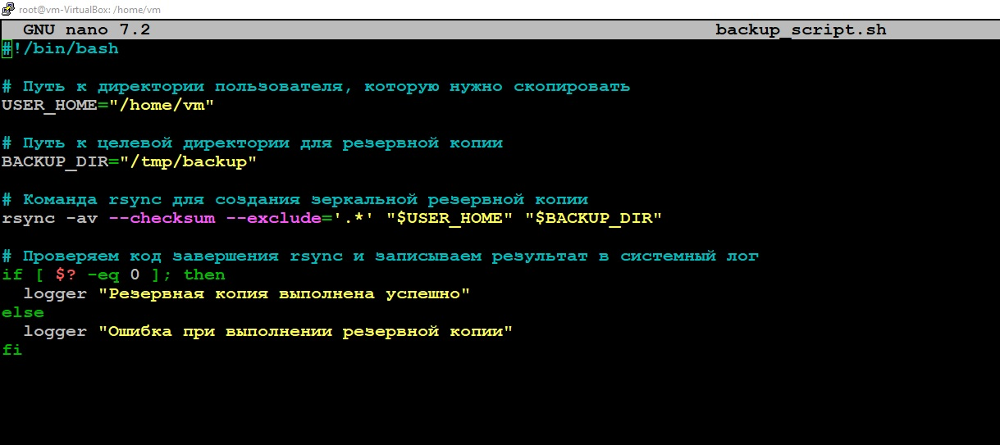
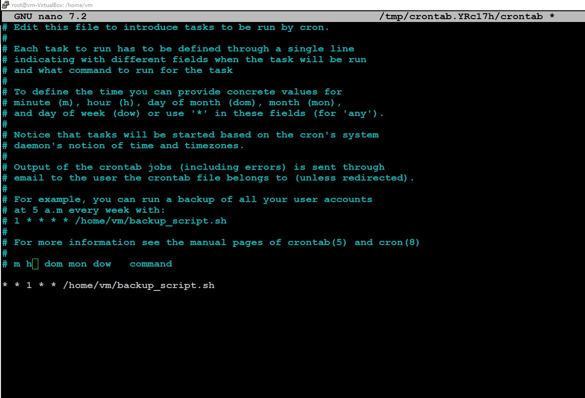
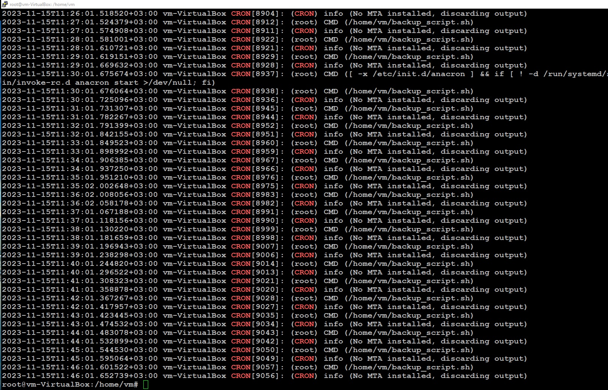

# `Домашнее задание к занятию "Резервное копирование"` - `Мешочков Александр SYS-22`


1. [Описание домашнего задания к занятию «Резервное копирование»](https://github.com/netology-code/sflt-homeworks/blob/main/3.md)

---

1. ### Задание 1

   - Составьте команду rsync, которая позволяет создавать зеркальную копию домашней директории пользователя в директорию `/tmp/backup`
   - Необходимо исключить из синхронизации все директории, начинающиеся с точки (скрытые)
   - Необходимо сделать так, чтобы rsync подсчитывал хэш-суммы для всех файлов, даже если их время модификации и размер идентичны в источнике и приемнике.
   - На проверку направить скриншот с командой и результатом ее выполнения


### Ответ 1




```bash
rsync -av --checksum --exclude='.*' ~/ /tmp/backup

```

```bash
Разберем, что делает каждая часть этой команды:

rsync: Команда для копирования файлов и директорий.
-av: Опции, которые включают режим архива (сохраняют атрибуты файлов и директорий), а также вывод подробной информации о выполнении команды.
--checksum: Эта опция указывает rsync на подсчет хэш-сумм для всех файлов, даже если их размер и время модификации идентичны. Это гарантирует точную проверку файлов при копировании.
--exclude='.*': Эта опция исключает все файлы и директории, начинающиеся с точки, что включает скрытые файлы и директории.
~/: Это исходная директория, которую вы хотите скопировать. ~ обозначает домашнюю директорию текущего пользователя.
/tmp/backup: Это целевая директория, куда будет скопирована домашняя директория.
```


--------

1. ### Задание 2

   - Написать скрипт и настроить задачу на регулярное резервное копирование домашней директории пользователя с помощью rsync и cron.
   - Резервная копия должна быть полностью зеркальной
   - Резервная копия должна создаваться раз в день, в системном логе должна появляться запись об успешном или неуспешном выполнении операции
   - Резервная копия размещается локально, в директории `/tmp/backup`
   - На проверку направить файл crontab и скриншот с результатом работы утилиты.


### Ответ 2





```bash
#!/bin/bash

# Путь к директории пользователя, которую нужно скопировать
USER_HOME="/home/USERNAME"

# Путь к целевой директории для резервной копии
BACKUP_DIR="/tmp/backup"

# Команда rsync для создания зеркальной резервной копии
rsync -av --checksum --exclude='.*' "$USER_HOME" "$BACKUP_DIR"

# Проверяем код завершения rsync и записываем результат в системный лог
if [ $? -eq 0 ]; then
  logger "Резервная копия выполнена успешно"
else
  logger "Ошибка при выполнении резервной копии"
fi
```


Добавил строку в crontab, чтобы выполнять скрипт ежедневно.



Для проверки, изменил время на каждую минуту :


