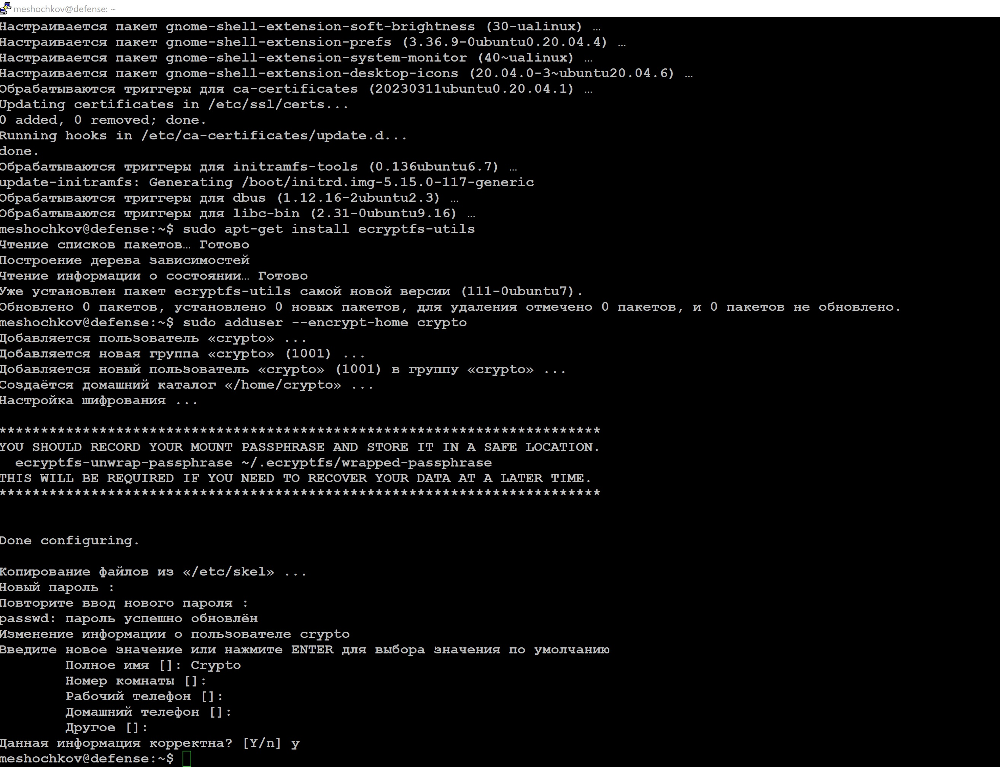
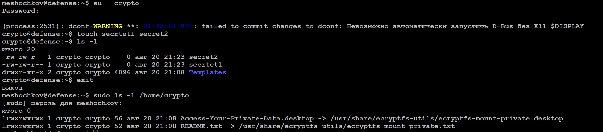
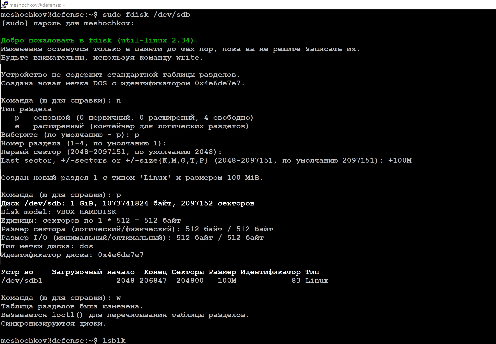
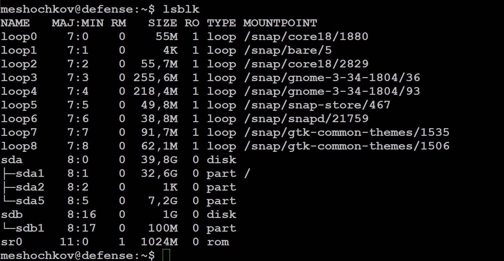
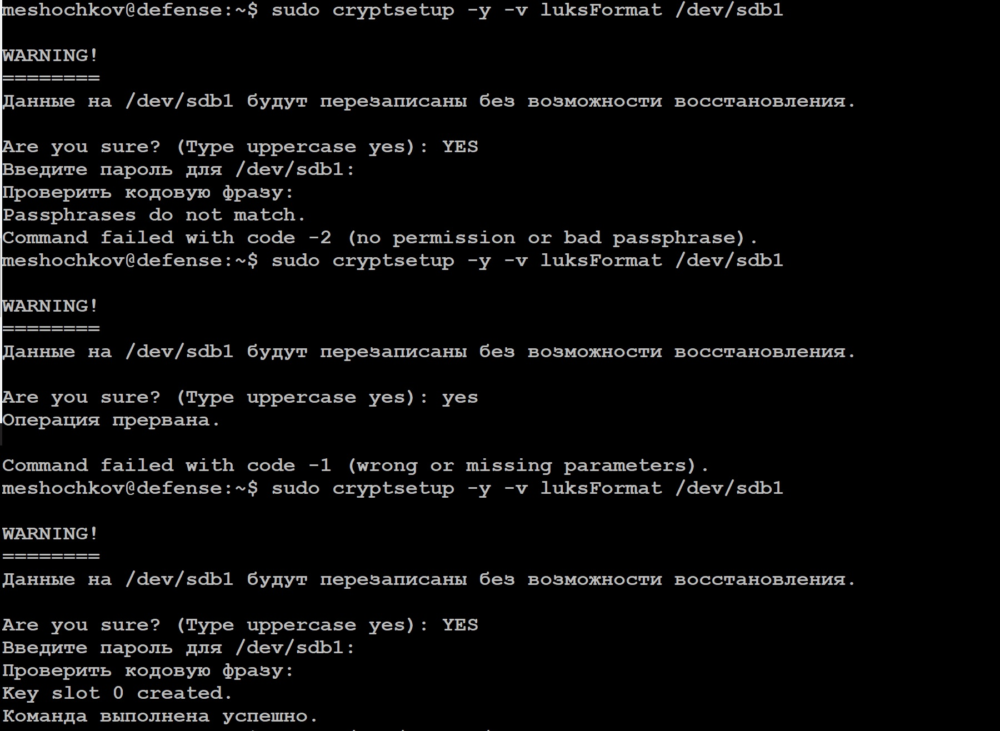
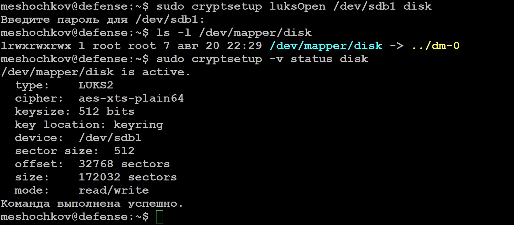
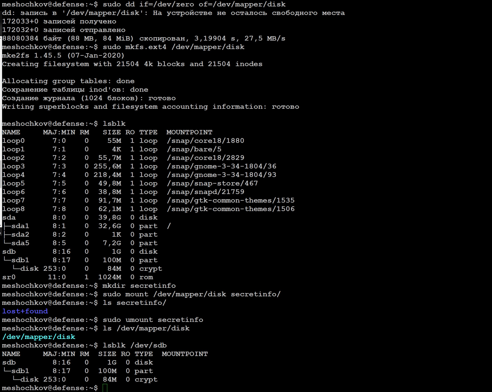

# `Домашнее задание к занятию "Защита хоста"` - `Мешочков Александр SYS-28`

1. [Описание домашнего задания к занятию «Защита хоста»](https://github.com/netology-code/sdb-homeworks/blob/main/13-02.md)

---

   
 Задание 1: 

1. Установите eCryptfs.
2. Добавьте пользователя cryptouser.
3. Зашифруйте домашний каталог пользователя с помощью eCryptfs.

В качестве ответа пришлите снимки экрана домашнего каталога пользователя с исходными и зашифрованными данными.

   
 Ответ: 

---

   
 Задание 2: 

1. Установите поддержку LUKS.
2. Создайте небольшой раздел, например, 100 Мб.
3. Зашифруйте созданный раздел с помощью LUKS.

В качестве ответа пришлите снимки экрана с поэтапным выполнением задания.

---

