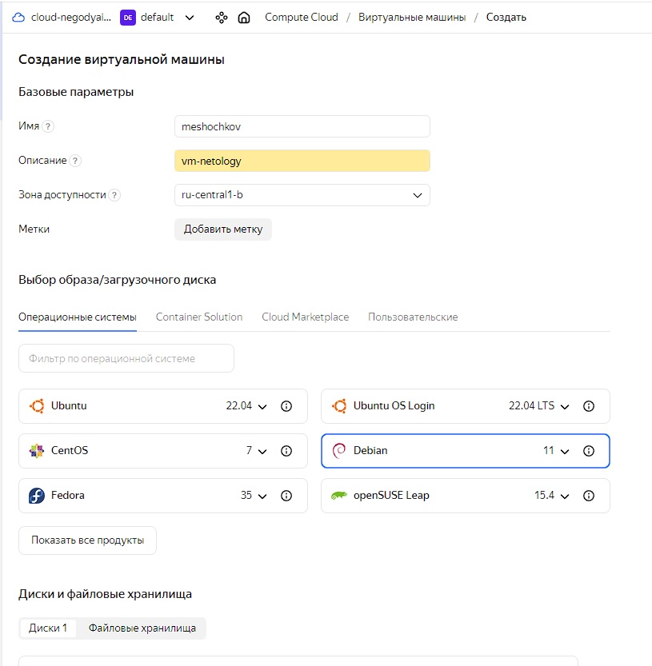

# `Домашнее задание к занятию "Обзор систем IT-мониторинга"` - `Мешочков Александр SYS-22`

1. [Домашнее задание к занятию «Обзор систем IT-мониторинга»](https://github.com/netology-code/smon-homeworks/blob/main/hw-01.md)

### Задание 1

