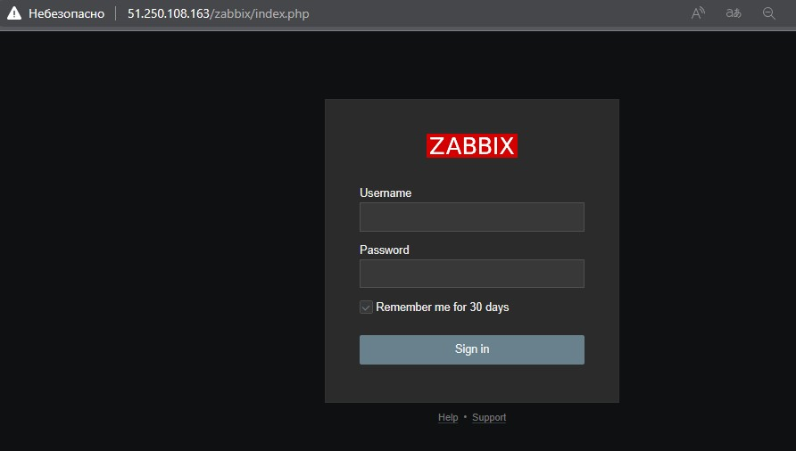
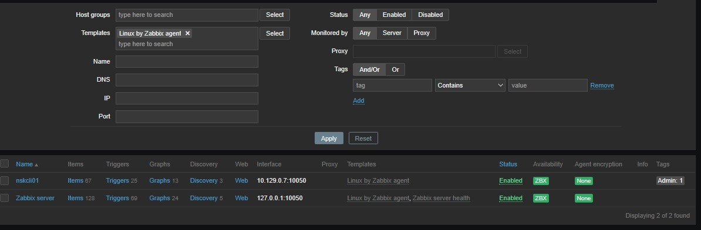
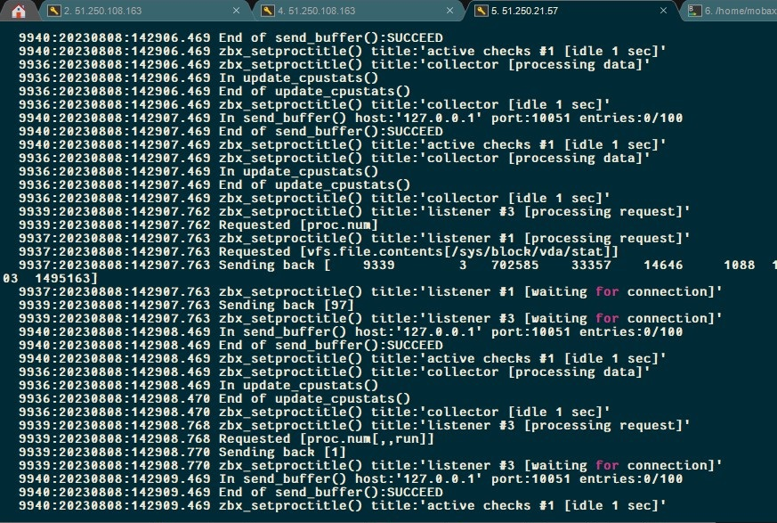
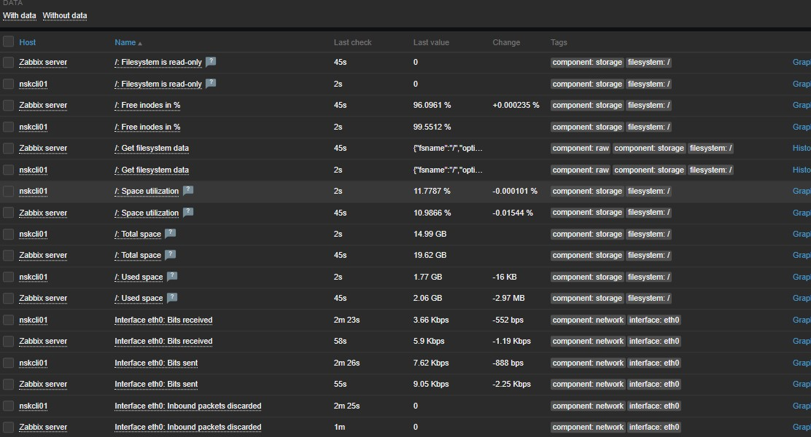

# `Домашнее задание к занятию "Система мониторинга Zabbix"` - `Мешочков Александр SYS-22`

1. [Домашнее задание к занятию «Обзор систем IT-мониторинга»](https://github.com/netology-code/smon-homeworks/blob/main/hw-02.md)

### Задание 1
Установите Zabbix Server с веб-интерфейсом.

Процесс выполнения
Выполняя ДЗ, сверяйтесь с процессом отражённым в записи лекции.
Установите PostgreSQL. Для установки достаточна та версия, что есть в системном репозитороии Debian 11.
Пользуясь конфигуратором команд с официального сайта, составьте набор команд для установки последней версии Zabbix с поддержкой PostgreSQL и Apache.
Выполните все необходимые команды для установки Zabbix Server и Zabbix Web Server.

# Используемые команды 
sudo apt install -y postgresql-13
wget https://repo.zabbix.com/zabbix/6.4/debian/pool/main/z/zabbix-release/zabbix-release_6.4-1+debian11_all.deb
sudo dpkg -i zabbix-release_6.4-1+debian11_all.deb
 sudo apt update
 sudo apt install zabbix-server-pgsql zabbix-frontend-php php7.4-pgsql zabbix-apache-conf zabbix-sql-scripts zabbix-agent
 sudo -u postgres createuser --pwprompt zabbix
 sudo -u postgres createdb -O zabbix zabbix
 zcat /usr/share/zabbix-sql-scripts/postgresql/server.sql.gz | sudo -u zabbix psql zabbix
 sudo nano /etc/zabbix/zabbix_server.conf
 sudo systemctl restart zabbix-server zabbix-agent apache2
 sudo systemctl enable zabbix-server zabbix-agent apache2

### Задание 2

Установите Zabbix Agent на два хоста.

Процесс выполнения
Выполняя ДЗ, сверяйтесь с процессом отражённым в записи лекции.
Установите Zabbix Agent на 2 вирт.машины, одной из них может быть ваш Zabbix Server.
Добавьте Zabbix Server в список разрешенных серверов ваших Zabbix Agentов.
Добавьте Zabbix Agentов в раздел Configuration > Hosts вашего Zabbix Servera.
Проверьте, что в разделе Latest Data начали появляться данные с добавленных агентов.

### Раздел Configuration > Hosts - видно, что агенты подключены к серверу

# Логи zabbix agent - видно, что он работает с сервером

# Раздел Monitoring > Latest data для обоих хостов, где видны поступающие от агентов данные.

# Используемые команды:

rpm -Uvh https://repo.zabbix.com/zabbix/6.4/rhel/7/x86_64/zabbix-release-6.4-1.el7.noarch.rpm
sudo yum clean all
sudo yum install zabbix-agent
sudo systemctl restart zabbix-agent
sudo systemctl enable zabbix-agent
sudo nano /etc/zabbix/zabbix_agentd.conf
sudo systemctl restart zabbix-agent