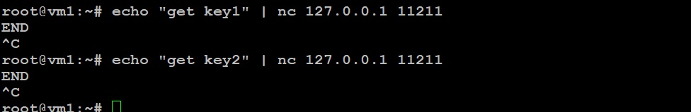

# `Домашнее задание к занятию "Кеширование Redis/memcached"` - `Мешочков Александр SYS-22`

1. [Описание домашнего задания к занятию «Кеширование Redis/memcached»](https://github.com/netology-code/sdb-homeworks/blob/main/11-02.md)

---

 ### Задание 1.Кеширование
Приведите примеры проблем, которые может решить кеширование.

Приведите ответ в свободной форме.

### Ответ 1

  
Ответ 1

Кеширование играет важную роль в оптимизации производительности и улучшении отклика системы. Вот несколько примеров проблем, которые может решить кеширование:

 - Медленные запросы к базе данных: Если система часто обращается к базе данных для выполнения одних и тех же запросов, кеширование позволяет сохранить результаты этих запросов в памяти. Повторные запросы могут быть удовлетворены из кеша, минимизируя нагрузку на базу данных и ускоряя отклик системы.

 - Частые вычисления или операции: Если в системе есть операции или вычисления, которые требуют значительных вычислительных ресурсов и часто повторяются, результаты этих операций могут быть закешированы. Повторные запросы могут быть обработаны намного быстрее за счет использования кеша.

 - Дорогостоящие операции ввода-вывода: Если в системе присутствуют операции ввода-вывода, такие как чтение больших файлов или обращение к внешним службам, результаты этих операций могут быть закешированы. Это уменьшит время ожидания и улучшит производительность приложения.

 - Динамически генерируемые контент и представления: Кеширование может быть использовано для хранения готовых HTML-страниц, изображений или других видов контента. Это особенно полезно в случае динамических веб-сайтов, где генерация контента требует значительных ресурсов.

 - Улучшение отзывчивости интерфейса пользователя: Кеширование клиентских данных и запросов к серверу может уменьшить задержки при загрузке данных, что способствует быстрому отображению информации и улучшает пользовательский опыт.

 - Оптимизация работы сетевых запросов: При работе с внешними API или удаленными серверами, кеширование ответов от этих серверов может существенно снизить задержки и улучшить отклик системы.

 - Уменьшение нагрузки на веб-серверы: Кеширование статических ресурсов, таких как CSS, JavaScript и изображения, позволяет уменьшить количество запросов к веб-серверу, снижая тем самым его нагрузку и улучшая быстродействие веб-приложений.

Кеширование является мощным инструментом оптимизации, который позволяет решать множество проблем, связанных с производительностью и отзывчивостью системы.

--------

 ### Задание 2. Memcached
Установите и запустите memcached.

Приведите скриншот systemctl status memcached, где будет видно, что memcached запущен.

### Ответ 2

  
Ответ 2

  

--------

1. ### Задание 3. Удаление по TTL в Memcached
Запишите в memcached несколько ключей с любыми именами и значениями, для которых выставлен TTL 5.

Приведите скриншот, на котором видно, что спустя 5 секунд ключи удалились из базы.

   

### Ответ 3

  
Ответ 3

    - Запустите memcached с указанием непривилегированного пользователя:
   
    - Установливаем ключи с TTL в 5 секунд:
   
    - Проверяем, что ключи были удалены:
   
    

--------

1. ### Задание 4. Запись данных в Redis
Запишите в Redis несколько ключей с любыми именами и значениями.

Через redis-cli достаньте все записанные ключи и значения из базы, приведите скриншот этой операции.

### Ответ 4

  
Ответ 4

   1)Установить Redis 
      	sudo apt install redis-server
   2)Запись данных в Redis:

3)Достаём все записанные ключи и значения:

--------
