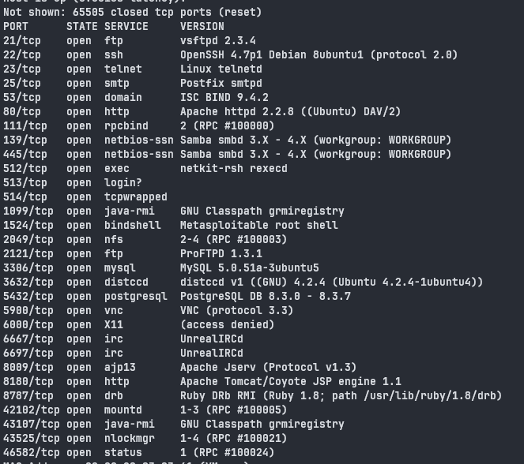
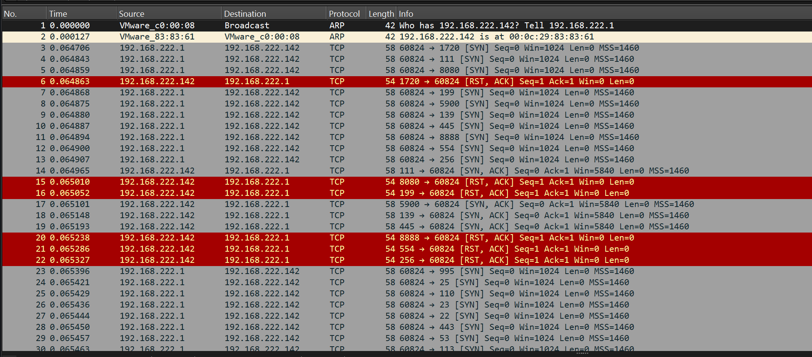
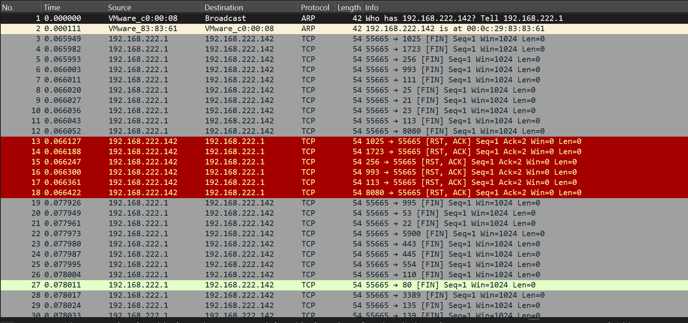
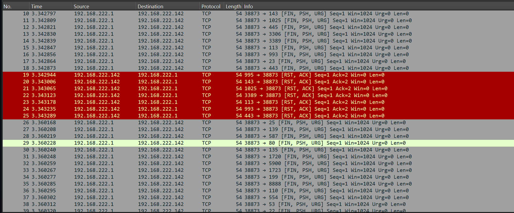
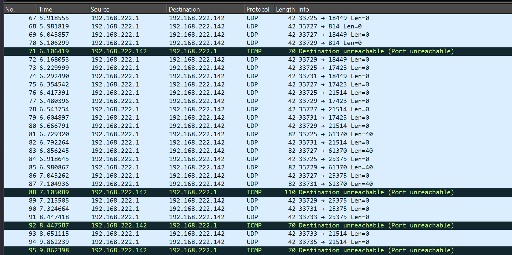

# `Домашнее задание к занятию "Уязвимости и атаки на информационные системы"` - `Мешочков Александр SYS-22`

1. [Описание домашнего задания к занятию «Уязвимости и атаки на информационные системы»](https://github.com/netology-code/sdb-homeworks/blob/main/13-01.md)

---

 ### Задание 1: 

   
 Задание 1 

### Задание 1

Скачайте и установите виртуальную машину Metasploitable: https://sourceforge.net/projects/metasploitable/.

Это типовая ОС для экспериментов в области информационной безопасности, с которой следует начать при анализе уязвимостей.

Просканируйте эту виртуальную машину, используя **nmap**.

Попробуйте найти уязвимости, которым подвержена эта виртуальная машина.

Сами уязвимости можно поискать на сайте https://www.exploit-db.com/.

Для этого нужно в поиске ввести название сетевой службы, обнаруженной на атакуемой машине, и выбрать подходящие по версии уязвимости.

Ответьте на следующие вопросы:

- Какие сетевые службы в ней разрешены?
- Какие уязвимости были вами обнаружены? (список со ссылками: достаточно трёх уязвимостей)
  
*Приведите ответ в свободной форме.*  

### Ответ 1

  
Ответ 1: 

  
Списко сетевых служб :

Обнаруженные уязвимости

1. [CVE:CVE-2011-2523](https://nvd.nist.gov/vuln/detail/CVE-2011-2523)
Эта Уязвимость в программном обеспечении или операционной системе, обнаруженная в 2011 году.
Она может позволить злоумышленникам взломать систему или получить несанкционированный доступ к данным.

2. [CVE-2014-3566](https://nvd.nist.gov/vuln/detail/cve-2014-3566)
Эта Уязвимость, обнаруженная в 2014 году, может быть в различных технологиях или программных продуктах.
Она Позволяет потенциальным атакующим осуществлять атаки посредством раскрытия информации, такие как "POODLE" атака в SSL.
3. [CVE:CVE-2007-6750](https://nvd.nist.gov/vuln/detail/CVE-2007-6750)
Эта  Уязвимость, обнаруженная в 2007 году, в каком-то программном обеспечении или системе.
Она Могла создать возможность для злоумышленников проникнуть в систему или провести другие атаки.

--------

 ### Задание 2: 

   
 Задание 2 

### Задание 2
Проведите сканирование Metasploitable в режимах SYN, FIN, Xmas, UDP.

Запишите сеансы сканирования в Wireshark.

Ответьте на следующие вопросы:

1) Чем отличаются эти режимы сканирования с точки зрения сетевого трафика?
2) Как отвечает сервер?

*Приведите ответ в свободной форме.*

 ### Ответ 2: 

   
 Ответ 2: 

1.1) SYN (TCP SYN Scan):

 * Что происходит: Клиент отправляет TCP-пакет с установленным флагом SYN. Если порт открыт, сервер отвечает SYN/ACK. Если порт закрыт, сервер отправляет RST.
 * Реакция сервера: Открывает порт: SYN/ACK. Закрывает порт: RST.

1.2) FIN (TCP FIN Scan):

* Что происходит: Клиент отправляет TCP-пакет с установленным флагом FIN. Если порт открыт, сервер должен проигнорировать пакет. Если порт закрыт, сервер отправляет RST.
* Реакция сервера: Открывает порт: Не реагирует на FIN. Закрывает порт: RST.

1.3) Xmas (TCP Xmas Scan):

* Что происходит: Клиент отправляет TCP-пакет с установленными флагами FIN, URG и PSH. Если порт открыт, сервер должен проигнорировать пакет. Если порт закрыт, сервер отправляет RST.
* Реакция сервера: Открывает порт: Не реагирует на Xmas Scan. Закрывает порт: RST.

1.4) UDP (UDP Scan):

* Что происходит: Клиент отправляет UDP-пакет на целевой порт. Если порт открыт, сервер может ответить. Если порт закрыт, сервер отправляет ICMP Port Unreachable.
* Реакция сервера: Открывает порт: Может отправить ответ (если сервер поддерживает UDP-ответы). Закрывает порт: ICMP Port Unreachable.

2)
SYN сканирование

FIN сканирование

Xmas сканирование

UDP сканирование

--------